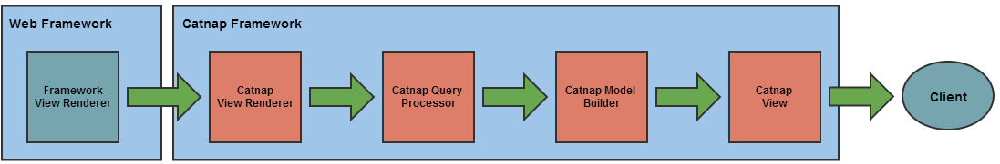

catnap
===

Catnap is a framework for supporting partial JSON and JSONP responses in RESTful web services by allowing users to supply arbitrary queries in the URL.

Catnap supports partial responses in the following web frameworks:

* 	Spring Boot
*   SpringMVC
* 	RESTEasy
* 	Jersey

##What is a partial response?
By default, the server will send back the full representation of a rest resource for every request.  Partial responses let you request only the elements you are interested in, instead of the full resource representation.  This allows your client application to avoid transferring, parsing, and storing unneeded fields, so you can utilize network and memory resources more efficiently.

For example, take the two responses below.  Both are requests for the same resource, but let's assume we are only interested in the following fields:

*	Product Name
*	List Price
*	Image Url for Thumbnail Images Only

###Full Resource Representation
*http://domain/product/12345/details*

	{
    	"id": "12345",
    	"name": "Product 1",
    	"prices": {
        	"listPrice": "$120.00",
        	"salePrice: "$89.99"
    	},
    	images: [
        	{
            	"sortOrder": 1,
            	"url": "http://domain/images/product/12345/primary.png",
            	"alt": "Product 1",
            	"size": "primary"
        	},
        	{
            	"sortOrder": 2,
            	"url": "http://domain/images/product/12345/thumbnail.png",
            	"alt": "Product 1",
            	"size": "thumbnail"
        	}
    	]
	}
	
###Partial Resource Representation
*http://domain/product/12345/details?fields=name,prices(listPrice),images(url)[size=thumbnail]*

	{
    	"name": "Product 1",
    	"prices": {
        	"listPrice": "$120.00",
    	},
    	images: [
        	{
            	"url": "http://domain/images/product/12345/thumbnail.png",
        	}
    	]
	}
	
##How does Catnap work?
Catnap works at the view / response rendering layer of your application by forcing your chosen web framework's view rendering to delegate to Catnap, intercepting the returned object models, evaluating them against the query supplied in the URL, and serializing the fields that result from the evaluation of the query.  

Catnap does not modify your returned response objects so your internal caching strategy does not need to be changed.  You can return full resource representations to Catnap, from cache, and Catnap will modify the response according to the query when it serializes the response to the wire.

**Response Rendering Steps:**

1. The web framework (Spring, Resteasy, or Jersey) receives a response to render.

2. The web framework calls a Catnap view renderer that supports the requester's desired content type.  The manner in which this call is made depends on the web framework.

3. The Catnap View Renderer calls query parsers to parse the Catnap query expression in the URL.

4. The Catnap query processor maps the parsed query expression to properties on the response object.

5. The Catnap Model Builder walks the response object model and selects fields that match the query expression; building a map of the object as it goes.

6. The Catnap View renders the object map built by the Model Builder to the wire.

##Documentation

Please see the [wiki](https://github.com/gregwhitaker/catnap/wiki) for detailed documentation on how to get started using Catnap.

##Examples

Please see the included [example projects](catnap-examples) for demonstrations on how to configure and use Catnap with all of the supported web frameworks.

## Bugs and Feedback

For bugs, questions and discussions please use the [Github Issues](https://github.com/gregwhitaker/catnap/issues).

##License
Copyright 2016 Greg Whitaker

Licensed under the Apache License, Version 2.0 (the "License"); you may not use this file except in compliance with the License. You may obtain a copy of the License at

http://www.apache.org/licenses/LICENSE-2.0

Unless required by applicable law or agreed to in writing, software distributed under the License is distributed on an "AS IS" BASIS, WITHOUT WARRANTIES OR CONDITIONS OF ANY KIND, either express or implied. See the License for the specific language governing permissions and limitations under the License.
